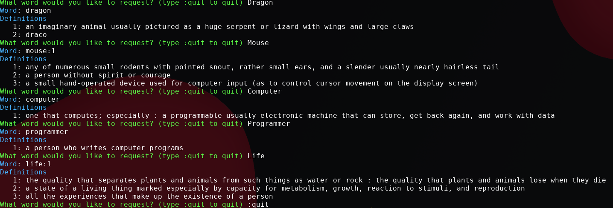

# CLI-Dictionary
This script runs in the terminal and retrieves definitions for a given word and returns them back.

## How it works
This script retrieves its data from the Merrian-Webster dictionary. To use it, you must get an api
key from Merrian Webster for the specific dictionary you would like to retrieve from. Put the api key
in the `/src/namespace/download/apikey.py` file. Once you have the api key, you can run `pipenv run start`
from the `CLI-Dictionary` folder.

## Example Usage
